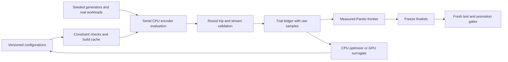

# Investigation: automatic encoder tuning and GPU-assisted search

Status: runnable phase-zero pilot, validated parameter adapter, controlled
factorial and initial three-seed CPU optimizer comparison. Production presets
and the Lean model are unchanged.
The adapter exposes five bounded axes behind `research-tuning`; model fitting,
latent-space learning and Bayesian optimization remain future spikes. See
[the CPU search report](cpu-search-report.md) for the initial implementation
and [the campaign report](cpu-search-campaign-report.md) for mixed workloads,
full-file regression checks and process RSS.

The aim is to discover useful speed/size/memory tradeoffs and then decide
whether adaptive selection and GPU-assisted optimization are worth their
cost. We will keep separate speed, compression and compromise candidates.
There is no assumed universal optimum or promise to beat every encoder.

## Questions and working hypotheses

1. **Search coverage or implementation cost?** Vary probe counts and
   insertion effort independently. If equivalent tokens become faster,
   optimize implementation; if different tokens improve the frontier,
   tune search policy. More probes are not assumed to improve output size:
   a locally longer match can change later parsing and Huffman costs.
2. **Index geometry?** Hash width, three/four-byte lookup and effective
   history can trade collisions against cache footprint. The encoded
   distance remains at most 32768; a larger hash table does not create a
   larger DEFLATE window. [RFC 1951](https://www.rfc-editor.org/info/rfc1951/)
3. **Parsing and block decisions?** Longest-match parsing may miss cheaper
   length/distance choices. Mixed compressible and random regions may
   benefit from per-block stored choices. These are algorithm spikes,
   separate from tuning existing constants.
4. **Context matters?** Text, binaries, records, random data and periodic
   data may need different configurations. First test explicit cheap
   features and a small decision tree; then investigate learned embeddings.
5. **Does the optimizer need a GPU?** CPU evaluation may dominate total
   tuning time. Compare whole search runs, including fitting and proposal
   overhead, rather than inferring an end-to-end gain from a matrix kernel.

The existing result in [tuning-report.md](tuning-report.md) is the starting
point: its settings were selected from a small manual sweep. Its former
holdout results are already visible and have informed this investigation;
that corpus is now a regression suite, not a fresh final test.

## Search space and constraints

Use a versioned configuration manifest. Encode categorical methods as
categories, not ordered floats; use log-scaled numeric search where useful.
Conditional fields must be inactive when their method does not use them.
Canonicalize configurations before hashing so inactive fields do not create
duplicate trials. The table describes the broader investigation; S1 currently
implements probe caps, greedy/lazy parsing, insertion tails, trigram/dual
indexes and four token split sizes. Other ranges remain proposed knobs.

| Group | First candidate axes | Constraints and scope |
| --- | --- | --- |
| History/index | effective window 1–32 KiB; hash bits 12–18; trigram, four-byte or dual index | Respect actual ring representation, checked distances and table memory; compile table layouts into separate builds |
| Search | probe caps 1–1024; good/nice lengths; separate short and long budgets | Positive finite bounds; early exit changes coverage, not token validity |
| Insertion | all positions, bounded tail, stride; batching thresholds | Keep checked matches; test ring wrap and collisions against scalar insertion where equality is intended |
| Parsing | greedy, one-step lazy; later bounded beam or dynamic programming | Greedy/lazy first; new parsers need their own implementation and cost spike |
| Emission/splits | 256–16384 tokens; cost margin; split locations; fixed/dynamic/stored policy | Current split callback is capped at 16384 upcoming tokens; per-block stored emission needs a model review |
| Classification | sample count/width, frequency and period thresholds | Include feature extraction and selection in encode timings; test sampling traps |
| Build | baseline release flags, target-specific specialization | Record flags and hardware; keep portable comparison separately |

“Dictionary” initially means the history and its search index. A preset
external dictionary changes the decoder's required initial state and is a
separate format/API investigation. Do not silently add one to the existing
raw-stream contract. Learned static dictionaries and alternative formats
belong in a later compatibility study.

Represent the measured objective vector as `(encode_ns, packed_bytes,
peak_memory_bytes)`, all minimized. Decode time, tiny-input latency, binary
size and family regressions are guardrails. Keep each axis and every raw
observation; avoid reducing all preferences to one permanently weighted
score. Use fixed normalized objectives/reference points for hypervolume
comparisons. Missing memory measurements must remain missing, not zero.

## Architecture



GPU proposals use predictions, not trusted objective values. Every proposed
winner must be evaluated by the actual encoder. Pause GPU work and other
heavy jobs while measuring CPU speed on this shared-memory machine.

For the first parameter spike, prefer a research-only validated configuration
adapter. Preserve exact default settings and run a default-byte equality
check. Build layout-changing configurations in isolated Cargo target
directories keyed by source, compiler, flags and canonical configuration.
Avoid repeatedly editing production constants or adding configuration
branches to the default hot path merely to support experiments.

The phase-zero adapter uses only public APIs:

- `stored`, `fast`, `balanced`, `best`;
- Balanced with fixed splits of 256, 1024, 4096 or 16384 **tokens**;
- pinned miniz_oxide 0.8.9 levels 1, 6 and 9 as measured controls.

Custom splitting currently uses Balanced. Fast × custom split is not a
supported combination in this pilot. Whole-input stored selection is a
method, not evidence of per-block stored selection.
The 16384-token split is a default-equivalent control: the runner requires
byte equality with Balanced and excludes the control from selection. A
timing difference may reflect API/compiler overhead or noise; investigate
it before attributing any gain to policy settings.

## Bounded spikes

Timeboxes below are planning estimates in focused engineering time, not
runtime guarantees. Stop a spike at its timebox, retain negative results,
and choose the next action from the evidence.

| Spike | Timebox / experiment budget | Deliverable and exit decision |
| --- | --- | --- |
| S0: measurement contract | 2–4 hours | Runnable adapter, manifest validation, raw rounds and decoder checks; reject missing/duplicate results and corrupt data |
| S1: knob exposure | 1 day; 16 boundary configurations | Research-only probe/insertion/split knobs and build caching; unchanged default output, bounded valid configurations |
| S2: sensitivity and interaction | 1 day; 128 initial trials, then at most 256 proposals | Effects of probe × insertion × index and split × data regime; narrow unhelpful axes without assuming monotonicity |
| S3: optimizer comparison | 1–2 days; same evaluation budget across 3 seeds | Random/space-filling baseline, CPU TPE or NSGA-II, mixed-variable Bayesian optimizer; compare verified frontier and time to reach it |
| S4: GPU crossover | Half day; 16–65536 batch sizes initially | Numerical/ranking checks and CPU/GPU fitting + scoring costs; use GPU only where whole-loop savings justify it |
| S5: workload-conditioned policy | 1 day; grouped cross-validation | Cheap features + tree versus fixed presets; count feature overhead and reject sampling-driven regressions |
| S6: latent representation | 1–2 days after enough measured data | Neural ensemble with uncertainty versus explicit features; require better prediction/calibration or fewer encoder evaluations |
| S7: encoded-cost parsing | 2–3 days; short exact oracle, bounded beam trials | Show where length/distance bit cost improves size and whether CPU cost belongs in Best; no heuristic optimality claim |
| S8: mixed-block emission | 1–2 days plus any required proof work | Header/alignment-aware stored/fixed/dynamic selection on regime changes; review Lean emitter scope before promotion |
| S9: validation and portability | 1 day per finalist/hardware set | Paired repeated measurements, decode/framing/fuzz checks, memory and size results; only publish claims for measured hardware and references |

S0, S1 and the device-scoring part of S4 are implemented here. S2 has a
128-configuration controlled factorial. The initial S3 comparison runs random,
Pareto mutation and Optuna NSGA-II at 32 unique configured evaluations per
strategy across three seeds. It includes full-file regression validation,
direct paired miniz comparisons and three process-RSS repeats on two selected
cases. These are bounded pilots; Bayesian acquisition, fresh-test promotion
and broader hardware/memory coverage remain outstanding.
S6 depends on S3 producing enough observations and on S5 establishing a
simple prediction baseline. S7/S8 may introduce genuinely better methods;
an optimizer cannot invent an algorithm absent from its candidate space.

CPU [Optuna TPE and NSGA-II](https://optuna.readthedocs.io/en/stable/reference/samplers/generated/optuna.samplers.NSGAIISampler.html)
provide comparison baselines. [BoTorch multi-objective acquisitions](https://botorch.org/docs/v0.16.0/multi_objective)
support GPU-assisted proposal optimization; compare a noise-aware acquisition
such as qLogNEHVI after handling the mixed/conditional space. The standard
CUDA/double setup is not directly an Apple-GPU setup: [MPS does not support
float64](https://docs.pytorch.org/docs/main/notes/mps.html). Locally, use an
MLX float32 neural ensemble if evidence supports it, or keep the optimizer
on the CPU. No cloud workload is part of this PoC.

## Synthetic data and split policy

`scripts/search_corpus.py` creates a manifest and deterministic `.raw`
payloads. A case seed is derived from generator version, master seed,
partition, family and parameters. The manifest records generator SHA-256,
parameters, size, data SHA-256 and cheap sample features. Re-running checks
both regenerated bytes and directory membership. A different generator,
seed or profile requires a new output directory.

The smoke profile has 72 cases: 20 training, 13 validation, 14 reserved test
and 25 boundary stress cases. Normal payloads start at 32 KiB; exact-distance
cases grow enough to exercise full-window references. Full mode raises the
normal size to 1 MiB. Cases are small enough to run locally; they are not a
representative replacement for real corpora.

| Family | Purpose | Implemented variation |
| --- | --- | --- |
| Alphabet | Separate symbol skew from repetition | 2–256 randomly selected symbols |
| Mutated periodic | Match length, word tails and batch insertion | Periods 1–258 with deterministic sparse mutations |
| Exact distance | Window edge, illegal-distance alternatives, ring wrap | Injected 258-byte copies at distances 1024–32769 |
| Four-byte hash collision | Long-chain cost for the current index | Inverted multiply hash creates aligned keys in one 15-bit bucket |
| Shared trigram prefix | Short-index collisions with divergent suffixes | Varying dictionary cardinality |
| Structured records | Reused keys and varying values | JSON-like records; varying key/value cardinality |
| Mixed regimes | Split and stored-block decisions | Random, periodic and structured segments of different widths |
| Sampling trap | Classifier robustness | Eight current sample locations look flat over repetitive data, or periodic over random data |
| Boundary/random and zero runs | Tail, stored length and window edges | Empty/tiny inputs, 257–259, 32767–32769 and 65535–65537 bytes |

Train/validation/test use disjoint parameter regimes and case seeds. The
checker rejects exact data or parameter-regime overlap across these three
splits. Same-family learning remains possible: add leave-one-family-out
experiments before claiming adaptation generalizes to unfamiliar workloads.
Zeros and boundary cases are shared **stress**, not pseudo-independent
holdout samples. The public generator means the reserved test is a process
boundary, not secret data. Freeze finalists and selection criteria before
measuring it. The PoC runner intentionally cannot evaluate `test`.

Generator additions for later spikes:

- Burst/Zipf symbol distributions, Markov transitions and repeated templates
  with insert/delete mutations; separate entropy from LZ reuse.
- Sparse matches at lengths 2/3/4/255/256/258, competing equal-length matches
  with different distance costs, and prefix chains with late divergence.
- Hash collisions under each candidate table width/hash function, not only
  today's 15-bit multiplier.
- Change points near sample, token-block and stored-block boundaries;
  smooth drift, alternating regimes and short incompressible islands.
- Larger-than-window working sets, multiple wraps and near-4-GiB position
  arithmetic (small reference simulation first, bounded large-file trials).
- Paired transforms: prepend, append, concatenate, duplicate, mutate one
  byte and move a change point. Require losslessness; do not assume
  compression ratio or speed is monotone under these transforms.

Keep fresh real workloads grouped by source or document lineage; deduplicate
near-identical files before splitting. Neither copies of training files nor
new seeds of an otherwise identical trivial pattern establish generalization.

## Verification and measurement contract

**Candidate validity:** enforce window, match-length, buffer, index and
split bounds before building/evaluating. Unsupported combinations are errors.
Validate each emitted stream with deflate-core, miniz and system zlib before
accepting its metrics. Python zlib checks payload equality, EOF and complete
byte consumption. Check determinism separately from equality to an older
encoder; heuristic changes may legitimately change compressed bytes.

**Implementation evidence:** compare scalar and optimized matcher behavior
when a spike promises equivalence. For new coverage policies, check every
accepted token and complete input expansion. Add candidate-configuration
boundary cases. The roundtrip fuzz target now also samples the validated
research adapter across its full integer bounds and all four split sizes.
Preserve/reduce failures by trimming input chunks, minimizing parameters and
retaining a reproducing seed, config and source hash.

**Proof boundary:** the existing Lean theorems quantify over arbitrary
checked finders, valid Huffman choices and checked split policies. They do
not prove heuristic quality, runtime speed, or the Rust implementation.
Changes to emitter structure, format assumptions or bounds require a model
review and potentially new proof work. Run the applicable Lean/axiom and
differential gates for any production candidate; see
[verification-boundary.md](verification-boundary.md).

**Timing:** warm by encoding/decoding outside measurement; rotate candidates
by file and round; preserve individual batch samples. Measure allocation,
feature extraction, parsing and emission together. Exclude input I/O and
oracle decoding from encoder timings. Use serial evaluation with GPU work
paused. The pilot defaults to five rounds with batches lasting at least
10 ms; finalist measurements should use at least ten paired sessions with
longer batches and explicit warm/cold allocation workloads.

Aggregate throughput is total raw bytes divided by summed per-file median
times. Also report per-family results, individual regressions and tiny-file
latency; large files must not hide regressions on smaller workloads. Measure
process peak RSS in separate runs with platform tools, then distinguish
process overhead from analytical table sizes. Do not infer peak memory from
the sum of table capacities alone.

**Noise and selection:** use paired baseline/candidate sessions and bootstrap
confidence intervals over sessions; file-level resampling answers a different
question. Keep deterministic output size separate from noisy timing.
Promising short-run Pareto points are provisional until longer repeats.
Repeat optimizer studies under identical trial and wall-time budgets across
multiple seeds. Count build, feature, model-fitting and proposal time in the
search budget. Record crashed, timed-out and invalid trials rather than
treating them as excellent missing measurements.

**GPU:** materialize arrays, warm both devices, rotate their order, evaluate
lazy results and synchronize before stopping clocks. Compare prediction
errors and candidate-ranking overlap on each batch. Strict full float32 is
the initial policy. MLX can use reduced precision despite float32 storage;
`MLX_ENABLE_TF32=0` requests full precision.
[MLX precision](https://ml-explore.github.io/mlx/build/html/usage/precision.html),
[evaluation](https://ml-explore.github.io/mlx/build/html/python/_autosummary/mlx.core.eval.html),
[synchronization](https://ml-explore.github.io/mlx/build/html/python/_autosummary/mlx.core.synchronize.html).

Every run needs compiler/library versions, CPU/GPU/platform, source and
binary hashes, corpus manifest, config, build flags and raw timing samples.
The pilot detects sources or manifest changes during measurement. A failed
run retains its provenance and is not promoted to a successful result.

## Runnable phase-zero tools

```sh
# No downloads or new Python dependency for the corpus/CPU pilot:
python3 scripts/search_corpus.py --profile smoke
python3 scripts/search_corpus.py --profile smoke --check
python3 scripts/test_search_tools.py
python3 scripts/search_poc.py --partition train
python3 scripts/search_poc.py --partition validation
python3 scripts/search_poc.py --partition stress --rounds 3 --min-ms 1

# Optional, separate MLX research environment on Apple silicon:
python3 -m venv target/search/venv
target/search/venv/bin/python -m pip install mlx==0.32.1
target/search/venv/bin/python scripts/search_gpu_spike.py --precision strict
target/search/venv/bin/python scripts/search_gpu_spike.py --precision reduced \
    --out target/search/gpu-reduced.json
```

`search_poc.py` builds the Rust example in a dedicated Cargo target and
stores packed streams, raw round samples, provenance, aggregate and family
frontiers under `target/search/runs/`. It measures eight existing candidates
and three reference levels. It is exhaustive enumeration of this small
space, not an adaptive optimizer. The frontier currently has two measured
axes; memory and learned proposals are explicitly future work.

`search_gpu_spike.py` scores synthetic 24-axis inputs through an **untrained**
128-wide network with four ensemble members and three hypothetical outputs,
then ranks candidates. It validates CPU/GPU numerical agreement and top-32
overlap. This establishes a kernel crossover only; it says nothing yet about
prediction quality, compression gains or optimizer convergence.

`make research-check` runs corruption/leakage, collision, exact-distance,
sampling-trap, Pareto and measurement-matrix integrity tests. CI runs these
without MLX and has no timing thresholds. `make research-poc` generates the
smoke corpus and measures the training split.

## Promotion and stop criteria

Freeze criteria before each study. Proposed first-study thresholds:

- A speed candidate should improve paired encode time by at least 10% with
  an agreed size bound; a size candidate should reduce bytes by at least
  0.5% with an explicit throughput cost. Preserve other nondominated points
  as compromise presets rather than selecting one universal setting.
- A GPU optimizer should reduce whole-loop wall time by at least 20% at
  comparable verified frontier quality. A faster scoring kernel alone is
  insufficient; keep a CPU fallback below the measured crossover.
- An adaptive/latent policy must beat the best simple baseline under grouped
  validation after charging feature/model overhead. If it does not, retain
  fixed presets or the smaller decision tree.
- Correctness gates, memory/binary-size accounting and fresh-test results
  precede production promotion. A clear measured tradeoff may justify a
  separate preset even when it does not improve both speed and size.

At the end of each spike, record hypothesis, configuration, evidence,
negative results, decision and next dependency. Publish measured claims with
their corpus, reference version, hardware and uncertainty. Parameter search
can find better candidates; it cannot certify a global optimum over all
algorithms or a learned latent space.

## Phase-zero observations

Measured observations and limitations are recorded in
[`scripts/reports/search-spikes.json`](../scripts/reports/search-spikes.json).
The report links a [compact trial ledger](../scripts/reports/search-measurements.jsonl)
retaining every CPU pilot round and output size/hash, alongside source/binary
hashes and GPU spike rounds. Packed streams and the full corpus/derived
reports remain under ignored `target/search/` and can be regenerated.

On this Apple M5, MLX 0.32.1, seven warmed/rotated scoring rounds:

| Candidate batch | Strict CPU median, µs | Strict GPU median, µs | GPU speed multiple |
| --- | ---: | ---: | ---: |
| 16 | 50.5 | 468.8 | 0.11× |
| 256 | 55.1 | 420.2 | 0.13× |
| 4096 | 350.5 | 730.5 | 0.48× |
| 65536 | 7613.1 | 4435.4 | 1.72× |

Full-precision CPU/GPU scaled error stayed below 3.83e-7, with identical
top-32 order in these batches. An earlier strict run reached 2.44× at the
largest batch; these short runs are hardware-capacity evidence, not a
stable end-to-end speedup estimate. The measured crossover is only bracketed
between 4096 and 65536; its exact location was not searched.

Reduced precision reached 2.12× at the largest batch, but scaled error rose
to 1.15e-3. The top-32 sets still matched while ordering agreement fell to
93.75% for batches 256 and above. The first default-precision attempt failed
the strict 1e-4 error gate. This supports explicit precision and rank checks;
it does not establish that reduced precision is unsuitable for every model.

CPU pilots verified **638 streams**: 220 training, 143 validation and 275
stress, across all eleven measured methods/reference levels. Both Rust
decoders and system zlib agreed with the inputs; zlib consumed every stream
exactly. The default-equivalent split control matched Balanced bytes on
every case and was excluded from frontier selection. No reserved test
performance was measured, and no candidate was promoted.

Phase-zero decision: proceed with S1 knob exposure and the CPU baseline in
S3. Those initial results are available in [the CPU search report](cpu-search-report.md),
followed by the [S2/S3 campaign](cpu-search-campaign-report.md).
Keep GPU scoring optional and batch it only if whole-loop measurements
support it. Model fitting, prediction quality, latent-space learning, wider
parameter spaces and final-test evaluation remain unimplemented research
spikes. Process RSS is now measured separately on two validation cases; it
has not become a third optimized objective or a general memory guarantee.
